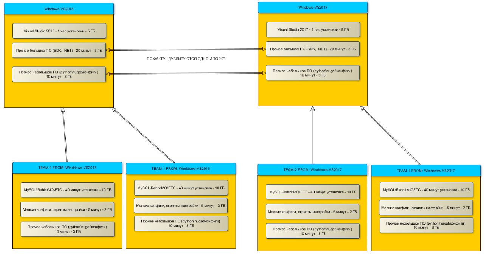

Как мы собираем проекты в выделенном окружении в Windows Docker
==========================================

------

- [Проблемы](#Проблемы)
    - [Дано](#Дано)
  
------
# Проблемы
## Дано
- Компания по разработке ПО
- ~10 главных продуктов (которые в состоят из компонент)
- Требуется разное сборочное окружение для команд (sdk, компиляторы, языки, etc)
- Выделенный отдел, который занимается сборочным окружением и помогает командам выстроить процессы CI (группа поддержки процессов Continious Integration)
- Компания поддерживает как текущие релизы ПО, так и старые (в том числе сертифицированные по требованиям ФСТЭК и других регуляторов)

## Как было раньше
Ищутся "похожие" продукты и компоненты (например, много компонент, которые собираются msbuild; компоненты написаные на dotnet, есть на c++)

Для таких компонент выделяется 3-4 сервера, в один пул, с идентичным окружением (ПО, переменные окружения) - например, cpp-пул (сборочные сервера для c++\c# проектов) с установленными студиями и .NET SDK

Если команде нужно изменение сборочного окружения 
- вносим изменение на один сервер
- смотрим чтобы ничего не сломалось у других проектов
- расскатываем изменения на остальные сервера

В начале это делалось вручную, потом - автоматизировано через salt

Делается для экономии сборочных ресурсов - только для компиляции и юнит-тестов используются 2 сервера с 256GB RAM, 16CPU Е5-2660, куча сторов с SSD суммарным объемом ~3TB

## Проблемы
1. **Сборочное окружение ломалось** - несовместимость ПО или кривая установка, приходилось откатывать ВМ на снепшот. При несовместимости ПО приходилось выделять для такого проекта новый "пул" серверов для сборки
2. **Командам хотелось изменять окружение самостоятельно** - но поскольку один сервер использовали несколько команд, такого позволить было нельзя
3. **Не соблюдалось требование отказоустойчивости** - иногда в "пул" серверов входил один сервер, поскольку проект маленький, если этот сервер ломался, команде приходилось ждать восстановления из бэкапа
4. **Не сохранялось сборочное окружение прошлых релизов** - если приходил баг из сертифицированной версии продукта, нужно собрать его с фиксом из тех же исходников. Окружение на сборочных серверах давно уехало вперёд

# Решение
Linux-продукты мы >3 лет уже собираем в docker, долго ждали когда такое же реализуют в Windows. Мы ждали, ждали и [наконец дождались](https://docs.microsoft.com/en-us/virtualization/windowscontainers/about/)!

В процессе внедрения столкнулись с проблемами, которые и разберём.

## Скрипты установки
Есть windows-docker, отлично, давайте на него что-нибудь поставим. Например, студию
```bash
# https://github.com/StefanScherer/dockerfiles-windows/blob/master/msbuild/Dockerfile
FROM microsoft/windowsservercore

SHELL ["powershell", "-Command", "$ErrorActionPreference = 'Stop'; $ProgressPreference = 'SilentlyContinue';"]

RUN (New-Object System.Net.WebClient).DownloadFile('http://download.microsoft.com/download/5/f/7/5f7acaeb-8363-451f-9425-68a90f98b238/visualcppbuildtools_full.exe', 'visualcppbuildtools_full.exe') ; \
    Start-Process .\visualcppbuildtools_full.exe -ArgumentList '/NoRestart /S' -Wait ; \
    rm visualcppbuildtools_full.exe
# На самом деле тут еще нужно бы почистить temp-папки
```

Но а где же apt-get в две строки как это было в Linux?
```bash
FROM gcc:6.3.0

RUN apt-get update \
    && apt-get install --yes --no-install-recommends cmake
```

Если такое требовать писать от разработчиков - они откажутся это делать, и будут опять просить нас установить нужное им ПО, но уже в докер. 

Хочется вот так (и реализовано) - код есть в репозитории

```bash
# EXE|MSI
RUN "C:\install-web\install-web.ps1"\
    -URL https://yourstorage.example.ru/win/packages/erlang/otp_win64_20.0.exe \
    -Filename erlang.exe \ 
    -InstallArgs '/S'

# ZIP
RUN "C:\install-web\install-web.ps1"\
    -URL https://yourstorage.example.ru/win/packages/msbuild/fullmsbuild.zip \
    -Filename setup.exe \ # имя файла ВНУТРИ архива
    -InstallArgs '/S'
    
# Установка и настройка RabbitMQ
ADD "download-and-unpack" "c:\scripts\download-and-unpack"
RUN "c:\scripts\download-and-unpack\download-and-unpack.ps1" \
    -URL https://yourstorage.example.ru/win/packages/rabbitmq/rabbitmq-server-windows-3.6.10.zip \
    -UnpackTo 'C:\Program Files'
ENV PATH 'C:\Program Files\RabbitMQ\3.4\bin';$PATH # проставлять в PATH значение нужно в отдельном шаге
```

## Долгий билд
Установка студии (только build-tools) на в контейнер занимает порядка 30 минут и весит такой слой 10ГБ. Чтобы каждая команда не устанавливала самостоятельно большие пакеты, есть несколько базовых образов, которые распространяет группа поддержки процессов Continious Integration


## Installation workflow
1. Сохранить exe\msi на сервер по адресу https://yourstorage.example.ru/win/packages - храним установщики, чтобы меньше зависить от интернета (не всегда получается, как например со msbuild-tools)
2. С помощью [USSF](http://www.softpedia.com/get/System/Launchers-Shutdown-Tools/Universal-Silent-Switch-Finder.shtml) найти ключи для установки в тихом режиме (без взаимодействия пользователя)
3. Добавляем строчку с помощью скрипта install-web.ps1 (или download-and-unpack) по аналогии с существующими


## Dockerfile
Итоговый Dockerfile можно на базовый образ с Visual Studio 2015 можно [посмотреть тут](windows-vc140/Dockerfile). Наследуемый от него образ - [windows-team1/Dockerfile]

## Прочие баги

### Отличие Windows-container от Linux
Windows-контейнер чуть больше, чем Linux. Помимо файлов, при установке программ, идёт активная работа с реестром, поэтому не получится просто взять и подключить volume с ПО.

https://habrahabr.ru/company/ruvds/blog/315220

### GetFinalPathNameByHandle 
Функция [**GetFinalPathNameByHandle**](https://msdn.microsoft.com/ru-ru/library/windows/desktop/aa364962%28v=vs.85%29.aspx?f=255&MSPPError=-2147217396)
неправильно отображает примапленные пути. Функция отображает относительные и прочие пути в полный путь используя **\\?\** синтаксис 

Подробнее 
- [MSDN](https://social.msdn.microsoft.com/Forums/en-US/3f111d9d-1223-42f1-a913-5caba4b773bc/getfinalpathnamebyhandlevolumenamedos-function-is-not-working-inside-container?forum=windowscontainers)
- [realpath](https://github.com/StefanScherer/dockerfiles-windows/tree/master/realpath)

На нас это повлияло в python-скриптах (именно их мы используем для автоматизации)
- В случае, если директория используется как Docker Volume, **GetFinalPathNameByHandle** неправильно отображает её - должен отображать в путь с \\?\, а отображает как есть

```python
mkdir c:\test
docker run -v c:\test:c:\test -it python:3.6-windowsservercore powershell
python

from nt import _getfinalpathname

_getfinalpathname('c:\\') # OK
_getfinalpathname('c:\\test')

>>> _getfinalpathname('c:\\test')
Traceback (most recent call last):
 File "<stdin>", line 1, in <module>
FileNotFoundError: [WinError 2] The system cannot find the file specified: 'c:\\test'
>>>
```

**Хак** (доступен в [Dockerfile](windows-vc140/Dockerfile)): патчить **pathlib.py**, заменяя используемые функции.

### 260 символов в filename
Многие сталкивались с прекрасным ограничением в Win32 API MAX_PATH=260 символов (когда файл нельзя назвать длинее 260 символов)

В Windows-docker проблема появляется - если к запускаемому докеру подключать директорию, то она подключается как symlink
- Безобидный **c:\build** превращается в **\\?\ContainerMappedDirectories\30FA5B39-9158-4785-A3A9-0435BFF32D2B**
- Даже если в хостовой системе путь допустимый и меньше 260 символов, то в docker он превращается в более длинный путь

У этой баги возможно есть фикс - обещали в локальных политиках дать возможность отключить ограничение на количество символов в имени. Но это не точно

### У каждого слоя - свой hostname
Проблема установки служб - у каждого слоя свой hostname, получается следующее:
1. Устанавливается в слое rabbitmq
2. В следующем - запускается
3. Проходят еще шаги
4. Запускается контейнер - но у него уже hostname другой, получается что rabbitmq ругается
```
Hostname mismatch: node "rabbit@202fd51f02fd" believes its host is different. Please ensure that hostnames resolve the same way locally and on "rabbit@202fd51f02fd"
```

### Silent install & GUI
Два примера:
1. gvim (vim для Windows) - ранее не поддерживал silent-установку, пришлось править инсталлятор (уже замерджено, возможно и инсталлятор исправленный выпустили)
2. .NET SDK 4.0 - устанавливается только в GUI-режиме

Надеюсь, со временем создатели ПО под Windows будут ориентировать на console mode, чтобы и установка и работа с приложениями была доступна из консоли

## Дальнейшее развитие
В дальнейшем, планируем использовать Windows Docker в следующих сценариях:
- Устанавливать продукты в docker и гонять интеграционные тесты
- Поставлять dev-окружение контейнерами
- Поставлять production docker-образы
